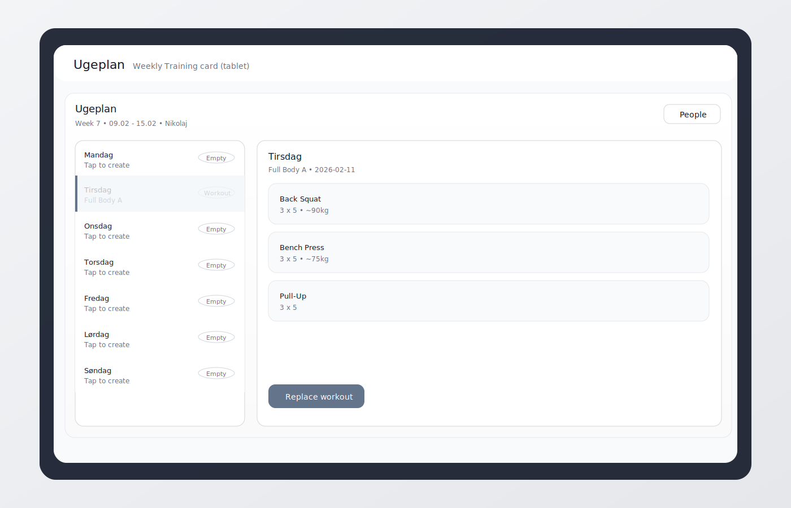
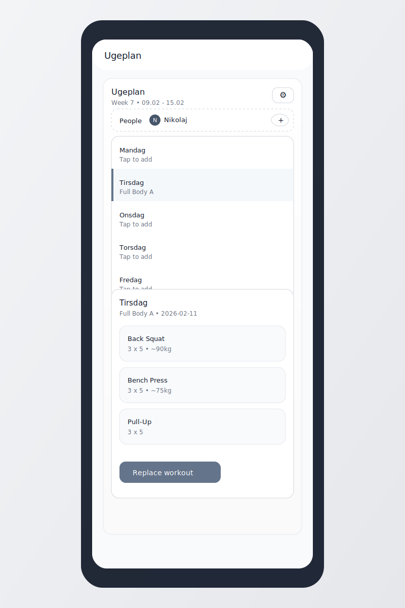

# Weekly Training (Home Assistant)

Weekly Training is a HACS-installable custom integration that generates **full body strength sessions** for a selected day, stored per **ISO week**.

It is designed for **tablet dashboards** (responsive down to mobile) and uses a HA-style custom card.

## Features

- People profiles (male/female), per-person defaults and 1RM maxes:
  - Squat (SQ), Deadlift (DL), Bench Press (BP)
- Person UX (tablet-friendly):
  - Tap avatar: set active person (UI accent follows)
  - Long-press avatar: edit person
  - Editable person color
- Weekly canvas:
  - `Week X` is shown at the top
  - Browse up to **3 weeks back/forward** using the week arrows (tap the week chip to jump back to the current week)
  - Suggested loads progress automatically week-to-week when planning ahead (default: **+2.5% / week** on main lift suggestions)
  - Pick a day from the left list and generate that day's session in a popup
  - New week starts blank (generate again)
  - Week rollover happens at **Monday 01:00** (local time)
- Choose planning mode:
  - `Auto`: let the generator pick exercises
  - `Manual`: optionally choose exercises for that session
- Exercise settings (gear icon):
  - Disable built-in exercises you don't want suggested (grid grouped by muscle group)
  - Add custom exercises (name + category + tags + equipment)
- Backup:
  - Import/Export people + exercise settings (Settings)
- Rule enforcement:
  - If you pick Squat, the generator will not suggest Deadlift (and vice versa)
  - Bench can be paired with either
- Uses only basic exercises (no machines) with barbell/dumbbell/band/bodyweight
- Workout actions:
  - Swipe right: mark Completed
  - Swipe left: delete workout
  - Undo is available via the snackbar after swipe actions
  - Bottom bar shows completed workouts for the current week across all people
- Intensity:
  - Pick `Easy/Normal/Hard` per session (affects suggested load % and volume)
- History:
  - Completed workouts are archived automatically at week rollover and kept for the last 4 weeks (Settings -> History)

## Install (HACS)

1. HACS -> Integrations -> three dots -> Custom repositories
2. Add this repo URL and select category `Integration`
3. Install `Weekly Training`
4. Restart Home Assistant
5. Settings -> Devices & Services -> Add Integration -> `Weekly Training`

## Add The Card (Tablet View)

Add a Manual card:

```yaml
type: custom:weekly-training-card
title: Ugeplan
```

If you have multiple entries, set `entry_id`.

Example full view YAML is in `docs/lovelace_tablet_view.yaml`.

### Card JS Loading

This integration registers the card JS automatically on startup. If you see `Custom element doesn't exist: weekly-training-card`:

1. Restart Home Assistant
2. Hard refresh the browser (or clear the HA app cache)
3. Optional (manual resource): add a Lovelace Resource pointing to:
   - `/weekly_training_files/weekly-training-card.js`

## Screenshots

Tablet (day list + workout detail panel):



Mobile (single column, same interactions):



## Entities You Get

- `button.weekly_training_generate_weekly_plan`
- `sensor.weekly_training_weekly_plan` (attributes include markdown + workouts)
- `select.weekly_training_person`
- `select.weekly_training_planning_mode`
- `number.weekly_training_session_minutes`
- `text.weekly_training_preferred_exercises`
- `select.weekly_training_session_*` (per-session overrides)

## Notes

- Suggested loads are based on your 1RM maxes and rounded to 2.5kg or 5lb increments (simple heuristics).
- This is not medical advice and not a substitute for coaching.
