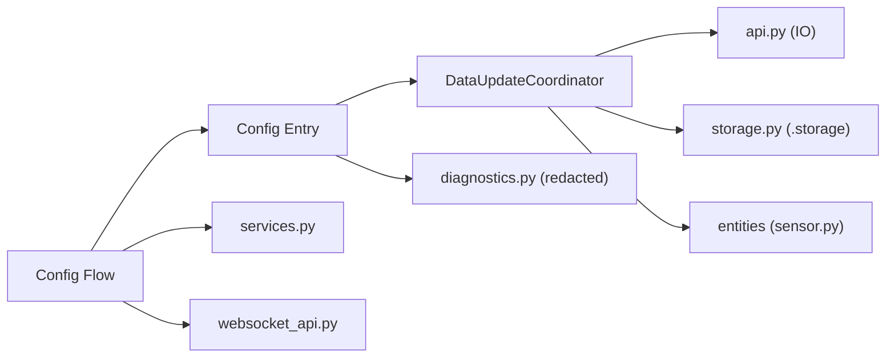

# Architecture

```mermaid
flowchart LR
  UI["Config Flow"] --> Entry["Config Entry"]
  Entry --> Coord["DataUpdateCoordinator"]
  Coord --> API["api.py (IO)"]
  Coord --> Store["storage.py (.storage)"]
  Coord --> Entities["entities (sensor.py)"]
  UI --> Services["services.py"]
  UI --> WS["websocket_api.py"]
  Entry --> Diagnostics["diagnostics.py (redacted)"]
```

